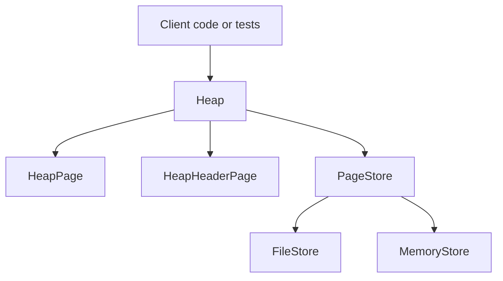
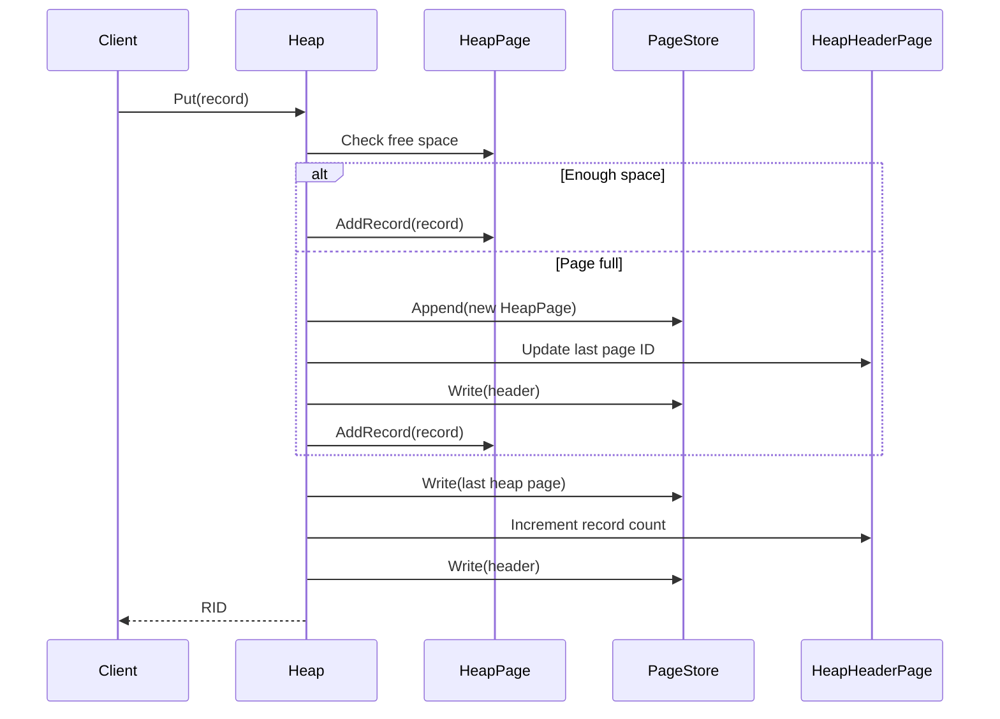

# Design Notes

This document describes the current architecture of the repository at a slightly lower level than the overview. It focuses on what is implemented, how the storage path works, and where the design is still incomplete.

## Architectural Summary

The codebase currently forms a small storage engine stack:

1. A `Page` abstraction defines the fixed-size binary unit of persistence.
2. A `PageStore` abstraction reads and writes pages.
3. Concrete stores provide either file-backed or in-memory persistence.
4. A `Heap` abstraction builds record-oriented operations on top of pages.
5. A `HeapScanner` provides sequential iteration over stored records.

## Layer Diagram

## Storage Model

### Page size

Pages are fixed at 8 KB. All page types serialize to the same fixed-size binary representation.

This gives the repository a consistent unit for:

- file offsets
- in-memory page buffers
- page marshaling and unmarshaling
- page-oriented metadata structures

### Page abstraction

Every concrete page implements a common interface with:

- identity via `PageID`
- a `PageType`
- `MarshalBinary`
- `UnmarshalBinary`

This keeps page persistence generic. The store does not need to know the internals of a heap page, overflow page, or allocation page. It only needs the page to serialize and deserialize itself.

## Page Stores

The `PageStore` abstraction is the boundary between logical storage structures and physical persistence.

### FileStore

The file-backed implementation treats each page ID as a fixed offset into a single file:

- page 0 starts at offset 0
- page 1 starts at offset `PageSize`
- page `n` starts at `n * PageSize`

This is a straightforward heap-file style layout and is sufficient for experimentation with paging behavior.

### MemoryStore

The in-memory implementation mirrors the file store but uses an in-memory slice of page buffers instead of a file. This makes tests faster and avoids disk I/O when persistence is not relevant to the behavior being tested.

## Heap Layer

The heap is currently the main higher-level storage abstraction.

It exposes operations to:

- insert a record
- fetch a record by RID
- update a record
- delete a record
- count stored records
- clear the heap

The heap owns two important page objects:

- a heap header page
- the current last heap data page

When a heap is initialized on an empty store, it creates:

1. page 0 as a heap header page
2. page 1 as the first heap page

## Heap Layout

The header page tracks:

- total record count
- ID of the last heap page

The heap itself is append-oriented. Inserts target the current last heap page until it runs out of space, at which point a new heap page is appended.

## Slotted Heap Page Design

The heap page uses a slotted-page layout to support variable-length records.

Important characteristics:

- records are stored inside a fixed-size page buffer
- slot metadata tracks record offset and length
- deleted records are marked in the slot table
- compaction reclaims fragmented free space
- slot 0 is reserved for free-space bookkeeping

This design allows stable logical addressing by slot number even when records are variable-sized.

## Record Addressing

Records are addressed by RID:

- `PageID`
- `Slot`

That means a record lookup is always a two-step operation:

1. load the page by ID
2. resolve the record within the page by slot

## Write Path

The current write path looks like this:

## Read Path

The current read path is simpler:

1. The caller provides an RID.
2. The heap loads the target page from the store.
3. The page resolves the slot and copies the record into the caller buffer.

## Delete Path

Delete is logical first and physical second:

1. The slot is marked deleted.
2. The page is compacted.
3. Free space becomes reusable within the page.

This is a simple and reasonable design for a prototype, although it does not yet include free-page reuse at the heap level.

## Sequential Scanning

`HeapScanner` walks pages and slots sequentially.

Its state machine roughly works like this:

1. read a page
2. iterate over slots on that page
3. skip deleted records
4. move to the next page
5. stop at EOF

This is enough to support full heap scans for validation and basic iteration.

## Concurrency Model

Concurrency is handled with simple mutex protection around mutable operations.

Examples:

- stores lock around writes and appends
- heap operations lock around updates
- page objects lock around serialization or in-page mutation

This is enough for basic safety inside the prototype, but it is not yet a full concurrency-control design.

## Incomplete or Future-Facing Areas

Several structures suggest the intended direction of the project:

- overflow pages for records too large to fit in a single heap page
- allocation bitmaps and allocation pages for tracking page usage
- a page directory abstraction
- a buffered page store
- a higher-level `DB` interface

Those pieces indicate the codebase is intended to grow beyond a simple append-only heap file, but most of that machinery is not yet integrated into the main flow.

## Main Limitations Today

The current implementation does not yet provide:

- a complete public database API
- indexing
- schema management
- transactions
- recovery or WAL
- sophisticated page reuse or free-space management across the entire store
- full overflow-record support

## Practical Interpretation

The cleanest way to think about the codebase today is:

- implemented core: page serialization plus heap-file storage
- supporting infrastructure: tests, scanners, and alternate stores
- future direction: richer storage management and eventual database semantics

For a reader coming fresh to the repository, the best starting path is:

1. `page.go`
2. `page_store.go`
3. `file_store.go` or `memory_store.go`
4. `heap.go`
5. `heap_page.go`
6. `heap_scanner.go`